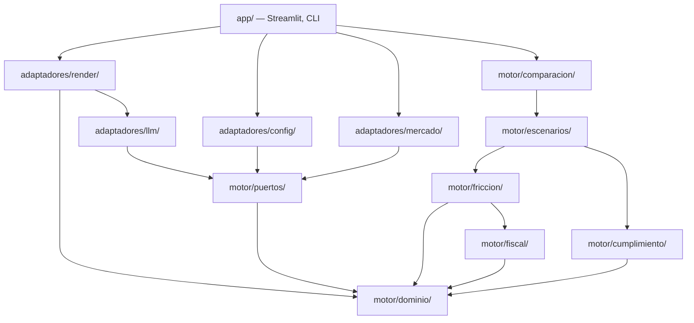
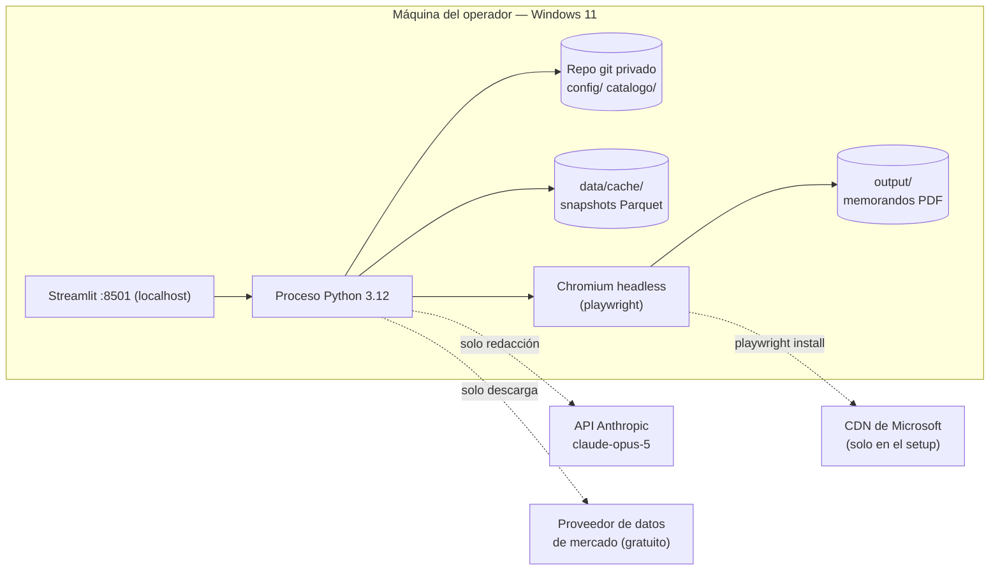

# Architecture Spine — Motor de Fricción Neta

## Design Paradigm

**Hexagonal (puertos y adaptadores) con núcleo funcional puro.**

El sistema tiene un centro determinístico y un anillo de adaptadores. El centro calcula; el anillo habla con el mundo. La dirección de dependencia apunta siempre hacia adentro.

| Capa | Paquete | Contenido |
|---|---|---|
| Núcleo | `motor/dominio/` | `Money`, `Cantidad`, `Concepto`, `Asiento`, `LibroDeAsientos`, `CurvaDeCambio`, `Lote`, `Posicion`, `ResultadoCelda`, `Procedencia`, `DestinoDividendo`, `Vehiculo`, `Escenario`, `ModoReajuste`, `PerfilCliente` |
| Núcleo | `motor/friccion/` | Evolución año por año de una posición como secuencia de lotes |
| Núcleo | `motor/fiscal/` | **Único** dueño del cálculo tributario: retención en origen, costo fiscal por lote, reajuste e impuesto colombiano |
| Núcleo | `motor/escenarios/` | Corre una posición en 3 escenarios × 3 modos × 2 mundos (AD-41) |
| Núcleo | `motor/comparacion/` | Barrido de N vehículos × 3 escenarios × 3 modos, deltas y ordenamientos |
| Núcleo | `motor/cumplimiento/` | Alertas §7 — levanta banderas, no calcula impuestos |
| Puertos | `motor/puertos/` | `RepositorioConfig`, `RepositorioCatalogo`, `FuenteMercado`, `RedactorNarrativo` |
| Adaptadores | `adaptadores/config/` | Carga YAML fechado por vigencia |
| Adaptadores | `adaptadores/mercado/` | Descarga y cachea snapshots Parquet |
| Adaptadores | `adaptadores/llm/` | Cliente Anthropic + guards de cumplimiento |
| Adaptadores | `adaptadores/render/` | Waterfall, HTML, PDF, disclaimers |
| Entradas | `app/` | Streamlit y CLI |

## Invariants & Rules



Ningún adaptador es dependencia de `motor/`: los adaptadores **implementan** los protocolos de `motor/puertos/`, y quien los inyecta es `app/`.

### AD-1 — Núcleo puro, dependencia hacia adentro

- **Binds:** todo el repositorio
- **Prevents:** que la lógica financiera adquiera dependencias de red o de UI, lo que la haría no testeable con casos calculados a mano y no auditable — los requisitos del brief §2.6 y §5
- **Rule:** todo módulo bajo `motor/` importa únicamente la stdlib, `decimal` y `pydantic`. Tiene prohibido importar `streamlit`, `anthropic`, `httpx2`, `httpx`, `requests`, `pyyaml`, `pyarrow`, `matplotlib`, `jinja2`, `playwright` o cualquier librería de E/S. `tests/test_arquitectura.py` recorre los `import` de `motor/` con `ast` y falla ante cualquier violación (gate en AD-25). Los adaptadores dependen del núcleo; el núcleo nunca depende de un adaptador.

### AD-2 — Local-first, cero infraestructura

- **Binds:** despliegue, operación, manejo de datos de cliente
- **Prevents:** costo recurrente en el MVP, y que datos fiscales de terceros salgan de la máquina del operador
- **Rule:** el sistema se ejecuta como un proceso Python local. No hay servidor, ni contenedor obligatorio, ni servicio gestionado en el MVP. Ningún componente asume un endpoint remoto salvo los adaptadores LLM y de mercado, ambos tras puertos.

### AD-3 — Sin motor de base de datos; dos niveles de almacenamiento

- **Binds:** toda persistencia
- **Prevents:** que dos módulos elijan hogares distintos para el mismo dato, y que la historia de vigencias tributarias quede sin rastro auditable
- **Rule:** el estado vive en exactamente dos sitios. **(a) Texto YAML versionado en git** para configuración tributaria, catálogo de vehículos, tarifas de bróker y los textos normativos de las alertas (AD-27) — el dato curado a mano, que debe tener historia auditable. **(b) Snapshots Parquet inmutables** bajo `data/cache/` para datos de mercado — el dato descargado y regenerable, en `.gitignore`. No se introduce ningún DBMS.

### AD-4 — Todo monto es `Money(Decimal, Moneda)`

- **Binds:** toda firma que cruce un límite de módulo
- **Prevents:** que dos módulos produzcan centavos distintos para el mismo cálculo, y que una suma mezcle COP con USD sin que nadie lo note
- **Rule:** ningún valor monetario cruza un límite de módulo como `float` ni como `Decimal` desnudo. `Money` lleva moneda explícita y **levanta `MonedaIncompatible` ante cualquier operación aritmética entre monedas distintas**; convertir exige pasar por `CurvaDeCambio` (AD-18). La cuantización a centavos ocurre solo al presentar, con `ROUND_HALF_UP`.

### AD-5 — El evento gravable anual se declara, no se deriva

- **Binds:** catálogo, `motor/fiscal/`, `motor/friccion/`
- **Prevents:** el defecto del brief §5.4 — condicionar el impuesto anual a "es distributivo" omite que CDT, TES y FIC generan rendimientos financieros gravables cada año sin que exista dividendo
- **Rule:** cada vehículo declara `evento_ingreso_anual: dividendo | rendimiento_financiero | ninguno_hasta_realizar`. El paso de impuesto anual despacha sobre ese campo, nunca sobre el tipo de distribución.

### AD-6 — Convención de TER declarada por vehículo

- **Binds:** catálogo, `motor/friccion/`
- **Prevents:** restar el TER dos veces, porque ya viene descontado del NAV de un ETF
- **Rule:** cada vehículo declara `retorno_esperado_base: bruto_de_ter | neto_de_ter`. El motor resta TER únicamente cuando la convención es `bruto_de_ter`. Campo obligatorio, sin valor por defecto.

### AD-7 — Configuración tributaria fechada, y falla ruidosa ante un hueco

- **Binds:** `adaptadores/config/`, `motor/fiscal/`, `motor/escenarios/`, `motor/cumplimiento/`, `motor/comparacion/`
- **Prevents:** que un parámetro faltante se rellene con un cero silencioso y produzca un memorando con una cifra inventada
- **Rule:** la configuración tributaria se indexa por `(escenario, vigencia_desde)`. El cargador levanta `ParametroTributarioFaltante` ante cualquier parámetro ausente o marcado con el centinela `TODO` que exige el brief §6. **Nunca existe un valor por defecto numérico.** Si un año simulado no tiene configuración vigente en algún escenario, el cargador levanta `VigenciaNoCubierta`: **nunca hereda en silencio de otro escenario**. Todo resultado calculado carga el identificador de la versión de config que usó.

### AD-8 — El motor devuelve un libro de asientos, no escalares

- **Binds:** `motor/friccion/`, `motor/fiscal/`, `motor/cumplimiento/`, `motor/comparacion/`, `adaptadores/render/`
- **Prevents:** que aparezca en el output una cifra que no se pueda descomponer, y que dos módulos reporten totales distintos para el mismo concepto
- **Rule:** el motor emite un `LibroDeAsientos` append-only. Todo total —retorno neto, desglose de fricción, porción atribuible a devaluación, TIR— se **deriva sumando el libro**. Ningún total se calcula por una vía paralela. El render lee el libro; no recalcula. La forma del `Asiento` la fija AD-17; su vocabulario, AD-20; su clave, AD-21.

### AD-9 — El adaptador LLM es de solo salida y está guardado numéricamente

- **Binds:** `adaptadores/llm/`, `adaptadores/render/`
- **Prevents:** que la prohibición de cifras del brief §8 sea solo una instrucción de prompt, que un modelo puede ignorar
- **Rule:** el adaptador LLM recibe un JSON de resultados ya calculados, nunca una petición de cálculo. Un guard determinístico normaliza y extrae todo token numérico de la prosa generada y **falla el render** si alguno no aparece en el JSON de origen. La normalización es parte del contrato: separadores de miles y decimales colombianos, porcentajes, puntos básicos y montos abreviados se canonizan antes de comparar. No hay ruta degradada: si el guard falla, no hay memorando. El guard es código con test propio, no una línea de prompt.

### AD-10 — Los disclaimers los emite el pipeline, no las plantillas

- **Binds:** `adaptadores/render/`, `app/`
- **Prevents:** que una ruta de salida nueva se publique sin el bloque legal que el brief §9 marca como requisito funcional bloqueante
- **Rule:** todo artefacto de salida —pantalla, HTML, PDF, Markdown— se emite por un único `Renderer` que adjunta el bloque de disclaimers y la fecha de vigencia de la configuración usada. Ninguna plantilla escribe disclaimers por su cuenta. Ningún módulo escribe un archivo de salida sin pasar por el `Renderer`.

### AD-11 — Datos de mercado tras un puerto, en snapshots inmutables

- **Binds:** `adaptadores/mercado/`, `motor/puertos/`
- **Prevents:** que cambiar de proveedor obligue a tocar lógica de negocio (brief §2.5), y que un memorando de hace seis meses no se pueda reproducir
- **Rule:** los datos de mercado se leen por el puerto `FuenteMercado` y se persisten como snapshots Parquet inmutables direccionados por contenido. Toda corrida registra el id del snapshot usado. Un snapshot nunca se sobrescribe. El proveedor elegido debe ser gratuito y sin credencial de pago (brief §2.5); un adaptador de pago exige reabrir esta decisión.

### AD-12 — PDF por Chromium headless, HTML como único intermedio

- **Binds:** `adaptadores/render/`
- **Prevents:** que la generación de PDF dependa de la cadena GTK+ (Pango, cairo, GDK-PixBuf), cuya instalación en Windows sigue exigiendo MSYS2 en WeasyPrint 69
- **Rule:** el memorando se compone en HTML con Jinja2 y se convierte a PDF con `playwright` en Chromium headless — `page.pdf()` es solo-Chromium, no funciona en Firefox ni WebKit. El HTML es el contrato; el motor de PDF es intercambiable detrás de él. **El setup exige `playwright install chromium` (~100–150 MB, una sola vez); `uv sync` no lo resuelve y el README debe listarlo como paso propio.**

### AD-13 — Monolito de un proceso

- **Binds:** todo el repositorio
- **Prevents:** pagar serialización, versionado de contrato y un modo de fallo distribuido sin recibir nada a cambio
- **Rule:** un solo paquete Python, un solo proceso. No se introducen servicios. Los límites internos se sostienen con AD-1, no con la red.

### AD-14 — La UI es un adaptador delgado

- **Binds:** `app/`
- **Prevents:** que la lógica de cálculo se filtre a los callbacks de la interfaz, donde no se puede testear
- **Rule:** `app/` compone y presenta; no calcula. Toda cifra que muestre viene de un `LibroDeAsientos`. La app Streamlit escucha en localhost y no se expone a la red.

### AD-15 — Intérprete fijado a Python 3.12

- **Binds:** entorno de desarrollo y ejecución
- **Prevents:** que dos entornos resuelvan versiones distintas de dependencias y produzcan cifras distintas
- **Rule:** `.python-version` fija 3.12 y `uv.lock` se versiona. Nadie ejecuta el proyecto con el intérprete del sistema.

### AD-16 — Un solo stack HTTP en el proceso

- **Binds:** `adaptadores/mercado/`, `adaptadores/llm/`
- **Prevents:** dos implementaciones de timeouts, reintentos y verificación TLS conviviendo en el mismo proceso, y dos adaptadores divergiendo en cómo tratan un fallo de red
- **Rule:** el adaptador de mercado usa `httpx2`, el mismo cliente que ya arrastra el SDK `anthropic` 1.0.0. No se añade `httpx` ni `requests`.

### AD-17 — El asiento es bimonetario, convertido al escribir

- **Binds:** `motor/dominio/`, `motor/friccion/`, `motor/fiscal/`, `motor/cumplimiento/`, `motor/comparacion/`
- **Prevents:** la contradicción entre AD-4 y AD-8 — `motor/friccion/` opera en USD y `motor/fiscal/` causa impuesto en COP; si cada uno escribiera su asiento en su moneda, derivar el retorno neto en COP sumando el libro levantaría `MonedaIncompatible` y el entregable del brief §5.7 sería imposible por construcción
- **Rule:** todo `Asiento` lleva `monto_origen: Money`, `monto_cop: Money`, `tasa_aplicada: Decimal` y `anio_tasa: int`. La conversión ocurre **al escribir el asiento**, dentro del núcleo, usando `CurvaDeCambio` (AD-18). Los totales en COP se derivan sumando `monto_cop`; los totales en moneda de origen, sumando `monto_origen` filtrado por moneda. Ningún consumidor convierte por su cuenta.

### AD-18 — La tasa de cambio tiene un solo dueño, y valoración ≠ transacción

- **Binds:** `motor/dominio/`, `motor/friccion/`, `motor/fiscal/`
- **Prevents:** que `motor/friccion/` valore un dividendo a tasa de cierre y `motor/fiscal/` lo grave a tasa de apertura, con lo cual la razón impuesto/dividendo dejaría de coincidir con ninguna tarifa de la configuración; y que el spread FX —30 a 100 puntos básicos, la magnitud que el brief §1 declara *ser el producto*— entre o no entre según quién calcule
- **Rule:** `CurvaDeCambio` es el único origen de tasas del sistema. Expone dos métodos **no intercambiables**: `tasa_valoracion(anio)` (TRM del año, sin spread — para valorar posiciones y causar impuesto) y `tasa_transaccion(anio, sentido)` (TRM más el spread del bróker según sentido — para convertir efectivo que efectivamente se mueve). Ningún módulo construye una tasa aritméticamente; ningún módulo aplica spread por su cuenta. El asiento registra cuál se usó en `tasa_aplicada` (AD-17).

### AD-19 — Fuente única de parámetros normativos

- **Binds:** `motor/fiscal/`, `motor/cumplimiento/`, `motor/comparacion/`, `adaptadores/config/`
- **Prevents:** que `motor/fiscal/` lea de la configuración del escenario B que el umbral de ganancia ocasional es 4 años y aplique cédula general, mientras `motor/cumplimiento/` tiene 2 años como constante de dominio y no levanta la bandera — un memorando que se contradice a sí mismo en la misma página, justo sobre el "requisito de honestidad" del brief §6
- **Rule:** todo umbral, tarifa, UVT, plazo y retención en origen se lee del objeto de configuración inyectado. **Ningún módulo del núcleo declara una constante numérica normativa.** Los valores por domicilio (retención en origen) viven en la configuración tributaria, no en el catálogo; el catálogo declara el domicilio, no su tarifa. `tests/test_arquitectura.py` falla ante literales numéricos en `motor/fiscal/` y `motor/cumplimiento/` fuera de constantes de unidad declaradas.

### AD-20 — `Concepto` es un vocabulario cerrado con dueño, signo y grupo

- **Binds:** `motor/dominio/`, todo módulo que escriba asientos
- **Prevents:** que la retención en origen —asignada a la vez a `motor/fiscal/` por la tabla de capas y a `motor/friccion/` por el bucle anual del brief §5.3— se escriba dos veces con nombres distintos y signos opuestos, produciendo doble conteo, dos barras en el waterfall para una sola fricción y, si los signos se cancelan, un total limpio y equivocado que ningún test unitario de módulo detecta
- **Rule:** `Concepto` es un `StrEnum` cerrado. Cada miembro declara su **módulo dueño**, su **signo** (aporte o detracción) y su **grupo de waterfall**. `LibroDeAsientos.append` rechaza un asiento cuyo concepto no pertenezca al módulo que escribe, y rechaza un signo contrario al declarado. **`motor/fiscal/` es el único dueño de todo concepto tributario**, incluidas la retención en origen, el ajuste por reajuste fiscal (AD-31) y el sobrecosto por fragmentación de lotes (AD-37); `motor/friccion/` los solicita, no los calcula ni los escribe.

### AD-21 — El libro tiene clave de corrida y el dominio es inmutable

- **Binds:** `motor/dominio/`, `motor/escenarios/`, `motor/comparacion/`
- **Prevents:** que `motor/escenarios/` construya un libro y lo pase a A, B y C mientras `motor/friccion/` le hace append, dejando tres asientos `TER` idénticos para el mismo año y triplicando la fricción de mercado. El fallo sobrevive a la convención de determinismo porque produce siempre los mismos bytes equivocados
- **Rule:** todo `LibroDeAsientos` se crea con la clave completa que fija AD-41 y **rechaza cualquier asiento cuya clave no coincida**. Todo tipo de `motor/dominio/` es `frozen=True`. Ninguna combinación de la clave comparte libro con otra; agregar entre ellas se hace leyendo libros, nunca escribiendo en uno común.

### AD-22 — El orden del paso anual es canónico

- **Binds:** `motor/friccion/`
- **Prevents:** que dos implementaciones apliquen apreciación, dividendo, retención, TER y custodia en órdenes distintos — sobre una base que cambia en cada paso, el orden altera el resultado y ninguna cifra sería reproducible
- **Rule:** el paso anual ejecuta exactamente la secuencia del brief §5.3, en este orden: apreciación de capital → dividendo bruto → retención en origen → destino del dividendo neto → TER (solo si AD-6 lo indica) → custodia. La corrida termina con un **paso terminal de realización**, posterior a la custodia del último año: su posición en la secuencia es parte del contrato, porque vender antes o después de la custodia mueve el reloj de tenencia doce meses. La secuencia vive en una única función y cada paso escribe su propio asiento. No hay atajo de fórmula cerrada. Cuando el destino del dividendo neto es la reinversión, el paso **crea un lote nuevo** (AD-29); nunca incrementa la cantidad de un lote existente. El spread cambiario del dividendo lo fija AD-51 según el modo de destino.

### AD-23 — Los guards de cumplimiento cubren las cuatro prohibiciones, no solo las cifras

- **Binds:** `adaptadores/llm/`, `adaptadores/render/`
- **Prevents:** que "la herramienta no recomienda" —que el brief §2.4 califica de restricción **regulatoria**, no estética— quede sostenida solo por el prompt del sistema, que un modelo puede ignorar. El guard numérico de AD-9 dejaría pasar intacta la frase "recomiendo el ETF irlandés", porque no contiene ninguna cifra inventada
- **Rule:** además del guard numérico, el pipeline aplica guards determinísticos que fallan el render ante: lenguaje recomendatorio, estimación de retornos futuros no presente en el JSON, e interpretación normativa fuera de los textos configurados (AD-27). Y verifica **presencia estructural**: un memorando sin sección de abogado del diablo no se emite, porque el brief §8 la declara obligatoria en todo memorando. Cada guard tiene test propio con casos positivos y negativos.

### AD-24 — Todo output es tri-escenario y tri-modo

- **Binds:** `motor/comparacion/`, `motor/escenarios/`, `adaptadores/render/`, `app/`
- **Prevents:** que exista una pantalla, una exportación o un `--escenario A` que presente un resultado en un solo escenario normativo o bajo un solo modo de reajuste, contra el "requisito de honestidad" del brief §6 y el criterio de aceptación §10.2
- **Rule:** las funciones públicas de `motor/comparacion/` devuelven siempre un resultado indexado por **escenario normativo × modo de reajuste** (3 × 3); no existe una firma que devuelva una sola celda. El `Renderer` (AD-10) rechaza un payload incompleto. Las celdas que un vehículo o perfil no admite (AD-32, AD-33) se emiten como no disponibles con su razón, **nunca se omiten en silencio ni se sustituyen por otro modo**. Si un vehículo gana en una celda y pierde en otra, la divergencia se emite en la primera página del memorando.

### AD-25 — El gate de calidad es un mecanismo concreto, no una intención

- **Binds:** todo el repositorio
- **Prevents:** que AD-1 diga "falla el build" y el brief §2.6 diga "no se mergea sin test" mientras no existe build ni merge que falle — las dos reglas más cargadas del spine delegando a un mecanismo inexistente
- **Rule:** el gate es un workflow de GitHub Actions sobre `push` y `pull_request` que ejecuta `ruff check`, `pytest`, y falla si la cobertura de `motor/fiscal/` o `motor/friccion/` baja de la línea acordada. `tests/test_arquitectura.py` corre dentro de ese gate. Un hook `pre-push` local ejecuta lo mismo para no descubrirlo en el remoto.

### AD-26 — La comparación entre vehículos tiene módulo dueño

- **Binds:** `motor/comparacion/`, `app/`
- **Prevents:** que Streamlit y el CLI construyan cada uno su propio barrido, ordenamiento y deltas, y reporten rankings distintos para los mismos datos — con AD-14 prohibiendo que `app/` calcule, el barrido del criterio §10.1 no tenía dueño
- **Rule:** `motor/comparacion/` es el único que corre N vehículos × 3 escenarios, deriva deltas y ordena. `app/` invoca y presenta. Todo ordenamiento es total y determinístico: ante empate en la métrica, desempata por identificador de vehículo.

### AD-27 — Los textos normativos son configuración

- **Binds:** `motor/cumplimiento/`, `adaptadores/config/`, `adaptadores/render/`
- **Prevents:** que las citas de norma de las alertas se incrusten como literales en el código, contra el brief §7 que las exige configurables, y que dos alertas citen la misma norma con redacciones distintas
- **Rule:** los textos de norma, concepto y advertencia de validación profesional viven en YAML fechado junto a la configuración tributaria (AD-3). `motor/cumplimiento/` emite identificadores de alerta; el texto lo resuelve el render. Una alerta sin texto configurado falla, no se degrada a un identificador crudo.

### AD-28 — La descomposición devaluación vs. rentabilidad tiene un solo método

- **Binds:** `motor/fiscal/`, `motor/comparacion/`, `adaptadores/render/`
- **Prevents:** que la cifra del criterio de aceptación §10.4 se calcule por dos métodos legítimos pero distintos —contrafactual (¿cuánto impuesto habría con TRM constante?) frente a proporcional (repartir la base entre componente cambiario y componente de rentabilidad)— y que dos vistas del mismo memorando muestren porciones distintas
- **Rule:** el método es contrafactual: se recorre la misma secuencia **lote por lote**, sustituyendo la `trm_reconocimiento` de cada lote por la tasa de entrada de la posición, y la porción atribuible a devaluación es la diferencia entre ambos impuestos. Se calcula dentro de un modo de reajuste fijo (AD-31), nunca cruzando modos. Vive en una única función de `motor/fiscal/`, escribe su propio asiento y nadie más la recalcula. El memorando declara el método y el modo usados.

### AD-29 — El lote es la unidad fiscal, no la posición

- **Binds:** `motor/dominio/`, `motor/friccion/`, `motor/fiscal/`
- **Prevents:** que el impuesto se calcule sobre una posición agregada. Al agregar se borra la fragmentación por tenencia: al vender, unos lotes superan el umbral de ganancia ocasional y otros no, y un cálculo agregado los trata a todos igual — subestimando sistemáticamente el impuesto del vehículo distributivo, que es justo la comparación que el producto existe para hacer bien
- **Rule:** `Lote` es inmutable y lleva `lote_id` (AD-38), `cantidad: Cantidad` (AD-45), `costo_origen: Money`, `trm_reconocimiento: Decimal` y `reconocimiento: (anio_fiscal, momento)` (AD-42). Una `Posicion` es una secuencia inmutable de lotes. **Toda reinversión de dividendo crea un lote nuevo**; ninguna operación incrementa la cantidad de un lote existente. Cada lote lleva su propio reloj de tenencia, medido en años fiscales completos (AD-42). La **clasificación** por tenencia y la determinación de base gravable se hacen **lote por lote** (AD-44 fase 1); la **tarificación** se hace sobre el agregado por cédula y año, que es la única forma correcta de aplicar una tabla progresiva y una exención anual (AD-44 fase 2). La asignación de lotes en venta la gobierna AD-39.

### AD-30 — La TRM de reconocimiento se congela por lote

- **Binds:** `motor/dominio/`, `motor/fiscal/`, `CurvaDeCambio`
- **Prevents:** reexpresar anualmente la base de costo en COP, que el art. 269 ET no permite; y que dos módulos apliquen TRM distintas al mismo lote
- **Rule:** `Lote.trm_reconocimiento` se fija en el reconocimiento inicial y es inmutable. `CurvaDeCambio.tasa_valoracion(anio)` **no se usa para recomputar la base de costo de un lote existente** — su uso en esa ruta es un defecto. Todo ajuste posterior al costo ocurre en COP sobre esa base, por la vía del modo de reajuste (AD-31), nunca por vía cambiaria.

### AD-31 — Los modos de reajuste son excluyentes entre sí

- **Binds:** `motor/fiscal/`, `adaptadores/config/`
- **Prevents:** sumar el ajuste del art. 70 y el del art. 73 sobre el mismo activo para la misma enajenación. Son alternativos y excluyentes; componerlos produce un costo fiscal inflado y una base gravable indefendible
- **Rule:** `ModoReajuste` es un `StrEnum` cerrado: `sin_reajuste | art_70 | art_73`. El costo fiscal ajustado se calcula por **exactamente un modo**. Cualquier ruta que intente componer dos ajustes levanta `ReajusteDoble`, con el mismo rigor con que `Money` levanta `MonedaIncompatible` (AD-4). Los tres modos corren siempre, como corridas separadas e independientes, nunca combinadas. Cada modo consume su propia serie temporal de parámetros: art. 70 un porcentaje por **año gravable**, art. 73 un factor por **año de adquisición**. Ambas series se cargan por AD-7 y AD-35; ningún valor se infiere ni se interpola.

### AD-32 — Elegibilidad art. 73 declarada; sin clasificar bloquea, no degrada

- **Binds:** catálogo, `motor/fiscal/`
- **Prevents:** que un vehículo cuya forma jurídica nadie clasificó caiga en silencio a `art_70` y produzca una cifra que el operador no puede defender ante el contador del cliente
- **Rule:** cada vehículo declara `forma_juridica_emisor` (`icav | plc | unit_trust | fondo_contractual | partnership | sociedad | otro`), `nombre_legal_completo`, `isin`, `fuente_documental` (referencia al prospecto o KID) y `elegibilidad_art_73` (`defendible | no_aplica | sin_clasificar`). Todos obligatorios, sin valor por defecto. **`elegibilidad_art_73` es un juicio normativo, no un dato de mercado: porta `procedencia` completa con `estado` igual que cualquier parámetro tributario (AD-35, AD-50).** Si es `sin_clasificar`, el modo `art_73` levanta `ElegibilidadNoClasificada` para ese vehículo. **Nunca hay degradación silenciosa a otro modo.** Si es `no_aplica`, la celda se emite como `NoDisponible` con su razón (AD-48).

### AD-33 — El reajuste exige activo fijo, y es del perfil, no del vehículo

- **Binds:** `motor/dominio/`, `motor/fiscal/`
- **Prevents:** aplicar reajuste a un activo que para ese contribuyente es inventario o parte de su actividad habitual de compraventa, donde no procede. Es una propiedad de quién tiene el activo, no de qué activo es — modelarla en el catálogo sería un error de ubicación
- **Rule:** `PerfilCliente` declara `activo_fijo: bool`, obligatorio y sin valor por defecto. Si es `false`, los modos `art_70` y `art_73` se emiten como `NoDisponible(RazonNoDisponible.PERFIL_NO_ACTIVO_FIJO)` (AD-48) y solo `sin_reajuste` produce cifras. **Las nueve celdas siguen existiendo**: seis vienen no disponibles, ninguna se omite, y el `Renderer` acepta el payload. **El motor nunca infiere este flag** a partir del vehículo, del horizonte ni de la frecuencia de operación.

### AD-34 — La secuencia del costo fiscal es canónica

- **Binds:** `motor/fiscal/`
- **Prevents:** que dos implementaciones apliquen conversión y reajuste en órdenes distintos. Reajustar en moneda de origen y luego convertir da un número distinto que convertir y luego reajustar, y ambas parecen razonables leídas por separado
- **Rule:** exactamente este orden, en una única función, con un asiento por paso: **(1)** costo de adquisición en moneda origen + comisiones de compra; **(2)** conversión a COP con `Lote.trm_reconocimiento` (AD-30, art. 269); **(3)** aplicación del modo de reajuste sobre esa base en COP (AD-31); **(4)** al vender, precio de venta convertido a COP − costo fiscal ajustado = base gravable; **(5)** clasificación por tenencia **del lote** (AD-29): ganancia ocasional o cédula general.

### AD-35 — Todo parámetro tributario declara su procedencia, y el output la propaga

- **Binds:** `adaptadores/config/`, `motor/fiscal/`, `motor/cumplimiento/`, `adaptadores/render/`, `adaptadores/llm/`
- **Prevents:** que un parámetro derivado de material no firmado por un profesional —y con una contradicción interna conocida entre dos de sus documentos— se presente al cliente como hecho establecido. Un parámetro sin procedencia visible es indistinguible de uno validado, y esa indistinguibilidad es el riesgo
- **Rule:** cada parámetro tributario lleva `procedencia: {fuente, fecha_vigencia, estado}` donde `estado` es `verificado_profesional | supuesto_no_verificado`. Campo obligatorio; su ausencia levanta `ProcedenciaNoDeclarada`. Ningún resultado que consuma un parámetro `supuesto_no_verificado` se emite sin la marca correspondiente propagada hasta el artefacto final. El `Renderer` (AD-10) rechaza un payload cuyos parámetros no declaren procedencia. Los guards de AD-23 fallan el render si la prosa presenta como establecido un parámetro no verificado.

### AD-36 — El valor patrimonial anual es una salida de primera clase

- **Binds:** `motor/fiscal/`, `motor/comparacion/`, `adaptadores/render/`
- **Prevents:** tratar el art. 73 como un cálculo puntual de la venta. Adoptarlo obliga a declarar el costo ajustado como valor patrimonial en **cada** declaración anual: es una obligación recurrente, y un motor que solo sabe liquidar la venta deja al operador sin la cifra que necesita todos los años
- **Rule:** el motor emite, **por lote y por año gravable**, el valor patrimonial correspondiente al modo de reajuste elegido. Es una capacidad de salida declarada, no un subproducto derivable del cálculo de venta.

### AD-37 — La fragmentación por lotes se reporta como métrica propia

- **Binds:** `motor/fiscal/`, `motor/comparacion/`, `adaptadores/render/`
- **Prevents:** que el sobrecosto de fragmentación quede sumido dentro del total de impuesto, donde es invisible. Es un costo específico del vehículo distributivo —cada reinversión reinicia un reloj de tenencia— que hoy nadie mide, y hacerlo visible es parte del producto
- **Rule:** la fragmentación se reporta por **dos salidas distintas**, porque un porcentaje no cabe en un `Asiento` (AD-17 obliga a `Money`): **(a)** un asiento en `Money` con el **sobrecosto** atribuible a fragmentación, es decir el impuesto pagado de más frente al mismo resultado sin fragmentar; **(b)** un **ratio** derivado, con denominador declarado por AD-47, emitido fuera del libro y junto al desglose de fricción, no dentro de él.

### AD-38 — El lote tiene identidad propia

- **Binds:** `motor/dominio/`, `motor/fiscal/`, `motor/friccion/`
- **Prevents:** que `frozen=True` haga que la igualdad sea por valor. Sin identidad, `identificacion_especifica` no tiene qué identificar; y peor, el contrafactual de AD-28 iguala la TRM de todos los lotes, con lo que dos lotes distintos se vuelven `==` y una exclusión por pertenencia elimina dos donde se vendió uno
- **Rule:** `Lote` lleva `lote_id`, derivado determinísticamente de `(corrida_id, vehiculo_id, secuencia_de_creacion)`. `lote_id` es **el único campo** que participa en `__eq__` y `__hash__`. Ninguna operación del núcleo compara lotes por valor.

### AD-39 — La asignación de venta tiene un dueño y un orden total

- **Binds:** `motor/fiscal/`, `motor/friccion/`, `motor/comparacion/`
- **Prevents:** que `motor/fiscal/` ordene los lotes por fecha y `motor/friccion/` por orden de la secuencia. Con la tenencia medida en años fiscales (AD-42) los empates son el caso normal, no la excepción, y la posición que `friccion` lleva al año siguiente dejaría de ser la que `fiscal` liquidó. Segundo flanco: una `identificacion_especifica` reoptimizada por celda haría las nueve celdas incomparables entre sí
- **Rule:** `AsignacionDeVenta` vive en `motor/fiscal/`, que es su **único** dueño; `motor/friccion/` consume el resultado y no reordena. El orden es **total y declarado**: `fifo` ordena por `(anio_fiscal, momento, secuencia_de_creacion)` — nunca solo por año. La asignación se calcula **una vez por corrida y se congela para las nueve celdas**; ninguna celda la reoptimiza.

### AD-40 — La venta parcial parte el lote por una única vía

- **Binds:** `motor/dominio/`, `motor/fiscal/`
- **Prevents:** que, siendo el lote inmutable, cada implementación invente qué representa el remanente. Un remanente que hereda el reloj y la TRM originales frente a uno "reconocido" en el año de la venta produce impuestos radicalmente distintos sobre la misma operación, sin ninguna reinversión de por medio
- **Rule:** `Lote.partir(cantidad)` es la **única** vía de fraccionar un lote. Devuelve dos lotes nuevos —vendido y remanente— que **heredan `trm_reconocimiento` y `reconocimiento` del original**; partir nunca reconoce nada de nuevo. El residuo del redondeo de cantidad (AD-45) se asigna al remanente. Ninguna otra ruta produce lotes a partir de un lote existente.

### AD-41 — La clave del libro cubre todas las dimensiones ortogonales

- **Binds:** `motor/dominio/`, `motor/escenarios/`, `motor/comparacion/`, `motor/fiscal/`
- **Prevents:** el peor defecto de la enmienda de lotes. Con clave `(corrida, vehículo, escenario)`, los tres modos de reajuste pasan el guard y escriben en el mismo libro; AD-8 obliga a sumarlo y el costo fiscal sale sumando los tres ajustes. `ReajusteDoble` (AD-31) **no lo atrapa**, porque vigila el cálculo, no la suma. Segundo flanco: el contrafactual de AD-28 escribe sus propios asientos porque AD-34 se lo exige, y el impuesto queda duplicado
- **Rule:** la clave de `LibroDeAsientos` es `(corrida_id, vehiculo_id, escenario, modo_reajuste, mundo)`, donde `mundo` es `real | contrafactual`. Son **18 libros por vehículo**. Ningún asiento cruza de un libro a otro. El barrido que las produce vive en `motor/comparacion/` (AD-26), nunca en `app/`.

### AD-42 — El tiempo se mide en años fiscales, no en fechas

- **Binds:** `motor/dominio/`, `motor/friccion/`, `motor/fiscal/`
- **Prevents:** que el lote lleve un reloj día a día que el motor anual no puede leer. Un lote de reinversión fechado en enero y otro en diciembre del mismo año arrojarían tenencias de más de dos años y de año y medio respectivamente, cruzando el umbral en sentidos opuestos y saltando entre la tarifa de ganancia ocasional y la marginal de cédula general sobre la misma operación
- **Rule:** el reconocimiento de un lote es `(anio_fiscal: int, momento: apertura | cierre)`. **No existe `fecha_adquisicion` en el dominio.** La tenencia se mide en **años fiscales completos** por una única función, y la regla del borde —qué ocurre cuando la tenencia iguala exactamente el umbral— está declarada y tiene test propio. El paso terminal de realización de AD-22 fija el momento de la venta.

### AD-43 — Índices y ventana del reajuste declarados, y el contrafactual sustituye un solo campo

- **Binds:** `motor/fiscal/`, `adaptadores/config/`
- **Prevents:** dos ambigüedades que mueven el costo fiscal en decenas de millones. **(a)** El art. 70 no dice por sí solo si su porcentaje se aplica al año en curso o de forma acumulada sobre los años de tenencia. **(b)** El art. 73 se indexa por "año de adquisición", y el lote tiene dos campos candidatos. Y una tercera: si "sustituir la TRM" del contrafactual (AD-28) se lee como "como si se hubiera adquirido a la entrada", el contrafactual **cambiaría el factor del art. 73** y dejaría de ser contrafactual de la devaluación
- **Rule:** la configuración de reajuste declara explícitamente su **ventana** (`anual | acumulada`) y su **campo de índice**; ninguno se infiere, y su ausencia levanta `ParametroTributarioFaltante`. El contrafactual de AD-28 sustituye **exactamente un campo**: la tasa de cambio. Deja intactos `anio_fiscal`, `momento` y todo índice de reajuste. Un test campo por campo lo verifica. **Cuál es la lectura normativa correcta de la ventana del art. 70 no la decide este spine: es un parámetro que el tributarista del operador llena** (AD-35).

### AD-44 — El impuesto se calcula en dos fases: clasificar por lote, tarificar por cédula

- **Binds:** `motor/fiscal/`
- **Prevents:** que "nunca sobre el agregado" (AD-29) prohíba **la forma correcta** de liquidar. Una tabla progresiva y una exención anual se aplican sobre la base agregada de la cédula en el año; aplicarlas lote por lote hace que tres lotes pequeños paguen una tarifa marginal distinta —y muy inferior— a la que corresponde a su suma
- **Rule:** **Fase 1, por lote:** determinar base gravable y clasificar entre ganancia ocasional y cédula general (AD-34 pasos 4 y 5). **Fase 2, por `(cédula, año_fiscal)`:** agregar las bases clasificadas y aplicar tarifa, tabla progresiva y exenciones sobre ese agregado. La prohibición de agregar de AD-29 rige la **fase 1**, nunca la fase 2. Cada fase escribe sus propios asientos y el libro conserva ambas.

### AD-45 — Las cantidades son tipadas, con escala y residuo declarados

- **Binds:** `motor/dominio/`, `motor/friccion/`, `motor/fiscal/`
- **Prevents:** que `cantidad` quede sin tipo. AD-4 cubre el dinero, no las participaciones: un `float` acumulando reinversiones fraccionarias haría que la suma de los lotes dejara de igualar la posición, y produciría lotes fantasma de una millonésima de unidad con reloj de tenencia propio y su propia fila en el valor patrimonial de AD-36
- **Rule:** `Cantidad` envuelve un `Decimal` de escala fija declarada. **`float` está prohibido en todo `motor/`**, no solo para dinero, y `tests/test_arquitectura.py` lo verifica. El residuo de todo redondeo de cantidad tiene destino explícito (AD-40). Un invariante de conservación comprueba que la suma de las cantidades de los lotes iguala la cantidad de la posición.

### AD-46 — Un asiento declara si es flujo o saldo

- **Binds:** `motor/dominio/`, `motor/fiscal/`, `adaptadores/render/`
- **Prevents:** que el valor patrimonial anual de AD-36 —que es un **saldo**, repetido por año— entre a un libro de **flujos** y se sume al retorno neto. Sobre un horizonte de años, sumar saldos anuales inflaría el resultado en un múltiplo del capital
- **Rule:** todo `Asiento` declara `naturaleza: flujo | saldo`. **Solo los flujos agregan.** Toda derivación de totales de AD-8 filtra por `naturaleza == flujo`. Los saldos se consultan por año y nunca se suman entre sí. `Concepto` (AD-20) declara la naturaleza de cada miembro, y `append` rechaza un asiento cuya naturaleza no coincida con la de su concepto.

### AD-47 — El ratio de fragmentación tiene denominador declarado

- **Binds:** `motor/fiscal/`, `motor/comparacion/`, `adaptadores/render/`
- **Prevents:** que "porcentaje de la ganancia" (AD-37) admita varios denominadores razonables —ganancia total, ganancia positiva, base gravable— que dan cifras muy distintas, incluso de signo contrario, para la misma venta
- **Rule:** el denominador es la **base gravable total de la enajenación**, declarado en el resultado junto al ratio. Cuando el denominador es cero o negativo, el ratio se emite como `NoDisponible` con su razón (AD-48); **nunca como cero**, que se leería como ausencia de fragmentación.

### AD-48 — El resultado de una celda es una suma cerrada

- **Binds:** `motor/comparacion/`, `motor/escenarios/`, `adaptadores/render/`, `app/`
- **Prevents:** que "no disponible" no tenga tipo. Sin él, AD-33 devuelve tres celdas donde AD-24 exige nueve y el `Renderer` rechaza el payload — dejando **sin memorando a todo perfil que no sea activo fijo**. Y coaccionar la celda ausente a cero la haría **participar en el ordenamiento** de AD-26 como si fuera el mejor resultado
- **Rule:** `ResultadoCelda` es una suma cerrada: `Disponible(...)` o `NoDisponible(razon)`, con `RazonNoDisponible` como `StrEnum` cerrado (`PERFIL_NO_ACTIVO_FIJO`, `ELEGIBILIDAD_SIN_CLASIFICAR`, `MODO_NO_APLICA`, …). Ningún consumidor coacciona `NoDisponible` a un número. El ordenamiento de AD-26 opera **solo** sobre celdas `Disponible`, y el resultado declara cuántas quedaron fuera y por qué.

### AD-49 — La procedencia se agrega por peor-gana y viaja con el asiento

- **Binds:** `adaptadores/config/`, `motor/fiscal/`, `adaptadores/render/`, `adaptadores/llm/`
- **Prevents:** que AD-35 no diga cómo se combinan procedencias distintas. Sin regla, un total podría quedar marcado como verificado mientras una de sus líneas no lo está. Y sin la lista de qué parámetros entraron, el guard de AD-23 no puede distinguir qué afirmación de la prosa es defendible: falla todo o no falla nada
- **Rule:** la agregación de `estado` es un retículo **peor-gana**: si cualquier insumo es `supuesto_no_verificado`, el resultado lo es. Cada `Asiento` carga además el `frozenset[ParametroId]` de los parámetros que lo produjeron, y esa propagación llega hasta el artefacto final. El guard de AD-23 consulta ese conjunto para decidir qué frases exigen la marca.

### AD-50 — Los juicios normativos del catálogo portan procedencia

- **Binds:** catálogo, `adaptadores/config/`, `motor/fiscal/`
- **Prevents:** que `elegibilidad_art_73` —el juicio más consecuente del catálogo, del que depende una diferencia de un cuarto del costo fiscal— viva junto a datos de mercado con solo una `fuente_documental` sin `estado`, evadiendo AD-35 y presentándose al cliente como hecho establecido
- **Rule:** todo campo del catálogo que sea un **juicio normativo** —`elegibilidad_art_73`, `evento_ingreso_anual`, `forma_juridica_emisor`— porta `procedencia` completa con `estado`, igual que un parámetro tributario. Los datos de mercado (TER, dividend yield) no la requieren. La distinción está declarada en el esquema, no librada al criterio de quien llena el archivo.

### AD-51 — El modo de destino del dividendo determina el spread cambiario

- **Binds:** `motor/friccion/`, `motor/dominio/`
- **Prevents:** que los tres modos de destino del dividendo compartan un mismo tratamiento cambiario. El spread es de 30 a 100 puntos básicos —la magnitud que el brief §1 declara *ser el producto*— así que aplicarlo donde no corresponde, u omitirlo donde sí, invierte comparaciones
- **Rule:** `DestinoDividendo` es un enum cerrado `reinvertir | acumular_caja | repatriar`, parámetro de la corrida con `reinvertir` por defecto. El spread se aplica **según el modo**: en `reinvertir`, en cada reinversión, porque un lote nuevo implica una conversión nueva; en `acumular_caja`, **no se aplica hasta la salida**, y el efectivo permanece en la moneda de origen; en `repatriar`, **cada año**. Se usa `CurvaDeCambio.tasa_transaccion` (AD-18) y nunca `tasa_valoracion`. El resultado declara siempre qué modo se usó.

## Consistency Conventions

| Concern | Convention |
|---|---|
| Idioma | Dominio, identificadores y documentos en español. Los términos fiscales colombianos se escriben como los nombra la norma (`ganancia_ocasional`, `cedula_general`, `reajuste_fiscal`), sin traducir ni abreviar |
| Nombres de módulo | `snake_case`; núcleo bajo `motor/`, adaptadores bajo `adaptadores/`, entradas bajo `app/` |
| Ids | Vehículo por ISIN cuando existe, si no `mercado:ticker` en mayúsculas (p. ej. `BVC:ECOPETROL`). Escenario por letra: `A`, `B`, `C`. Snapshot de mercado por hash de contenido. Corrida por UUID generado en `app/` e inyectado, nunca dentro del núcleo |
| Fechas | ISO-8601 (`2026-08-24`). Toda config lleva `vigencia_desde`; el año fiscal es un entero explícito, nunca derivado de `today()` dentro del núcleo |
| Dinero y tasas | `Money(Decimal, Moneda)` (AD-4). Tasas y porcentajes como `Decimal` en fracción (`0.30`), nunca en puntos porcentuales. Puntos básicos solo al presentar |
| Errores | El núcleo levanta excepciones tipadas del dominio (`ParametroTributarioFaltante`, `VigenciaNoCubierta`, `MonedaIncompatible`, `ReajusteDoble`, `ElegibilidadNoClasificada`, `ProcedenciaNoDeclarada`, `ConceptoAjeno`, `NaturalezaAjena`, `ClaveDeLibroAjena`, `CantidadNoConservada`, `ConvencionTerNoDeclarada`). El núcleo nunca registra logs ni imprime: devuelve o levanta |
| Configuración | Solo YAML, parseado con `pyyaml` y validado con modelos `pydantic` en el borde. Dentro del núcleo circulan objetos validados, nunca `dict` crudos. Toda entrada tributaria lleva `procedencia` (AD-35); las series de reajuste llevan una entrada por año, sin interpolar los faltantes |
| Series temporales normativas | Una entrada por año, explícita. Art. 70 se indexa por **año gravable**; art. 73 por **año de adquisición**. Un año ausente levanta `VigenciaNoCubierta`; nunca se interpola, extrapola ni hereda del año vecino |
| Determinismo | El núcleo no lee reloj, ni entorno, ni aleatoriedad. Año fiscal, semilla y `corrida_id` entran como parámetros. Dos corridas con los mismos inputs producen bytes idénticos |
| Tiempo | El dominio no conoce fechas de calendario: solo `(anio_fiscal: int, momento: apertura \| cierre)` (AD-42). La tenencia se mide en años fiscales completos |
| Números no monetarios | `float` está prohibido en todo `motor/`, no solo para dinero. Las cantidades usan `Cantidad` (AD-45); los ratios son `Decimal` |
| Tests | Los casos de `motor/fiscal/` y `motor/friccion/` se calculan a mano y se documentan con su aritmética en el propio test. Un caso derivado de correr el código no cuenta como caso conocido |
| Secretos | La API key de Anthropic se lee del entorno en `app/`, nunca en el núcleo, nunca en un archivo versionado |

## Stack

Versiones de PyPI verificadas en vivo contra su API JSON el 2026-08-24.

| Name | Version | Nota |
|---|---|---|
| Python | 3.12 | Fijado en `.python-version` (AD-15) |
| uv | 0.12.5 | **Vigente en PyPI. La máquina del operador tiene 0.10.5 (2026-02-24) — requiere actualizar** |
| pydantic | 2.13.4 | Validación de config y catálogo |
| pyyaml | 6.0.3 | Parser YAML — `pydantic` no parsea YAML |
| httpx2 | ≥2.0.0,<3 | Único stack HTTP (AD-16); lo arrastra `anthropic` |
| streamlit | 1.62.0 | UI local |
| matplotlib | 3.11.1 | Waterfall |
| pyarrow | 25.0.1 | Snapshots Parquet; wheel `cp312-win_amd64` |
| jinja2 | 3.1.6 | Plantilla HTML del memorando |
| playwright | 1.62.0 | HTML→PDF; exige `playwright install chromium` |
| anthropic | 1.0.0 | **Major publicado el 2026-08-20; migró a `httpx2`. Ver su MIGRATION.md** |
| pytest | 9.1.1 | |
| ruff | 0.16.4 | |
| Modelo LLM | `claude-opus-5` | $5 / $25 por MTok |

## Structural Seed



En operación normal solo salen dos flechas de la máquina, ambas tras un puerto (AD-9, AD-11). La tercera ocurre una única vez, durante el setup. Ningún dato fiscal de cliente cruza hacia el proveedor de mercado.

```text
AppInversiones/
  motor/                  # NÚCLEO PURO — sin E/S, sin red, sin UI (AD-1)
    dominio/              # Money, Cantidad, Concepto, Asiento, Libro, CurvaDeCambio, Lote,
                          #   Posicion, ResultadoCelda, Procedencia, DestinoDividendo
    friccion/             # secuencia anual canónica; reinvertir crea lote (AD-22, AD-29)
    fiscal/               # costo fiscal por lote, reajuste, impuesto en 2 fases (AD-29..AD-50)
    escenarios/           # una posición en 3 escenarios × 3 modos × 2 mundos = 18 libros
    comparacion/          # N vehículos × 3 × 3 (AD-24, AD-26)
    cumplimiento/         # alertas §7 — emite ids, no textos (AD-27)
    puertos/              # Protocol: RepositorioConfig, FuenteMercado, RedactorNarrativo
  adaptadores/
    config/               # YAML fechado, falla ruidoso ante TODO (AD-7, AD-35)
    mercado/              # httpx2 + snapshots Parquet inmutables (AD-11, AD-16)
    llm/                  # cliente Anthropic + guards (AD-9, AD-23)
    render/               # waterfall, HTML, PDF, disclaimers (AD-10, AD-12)
  app/                    # Streamlit + CLI — compone, no calcula (AD-14)
  config/
    tributario/           # escenario-a.yaml, escenario-b.yaml, escenario-c.yaml
    reajuste/
      art-70.yaml         # porcentaje por AÑO GRAVABLE — TODO, con fuente (AD-31)
      art-73.yaml         # factor por AÑO DE ADQUISICIÓN — TODO, con fuente (AD-31)
    alertas.yaml          # textos normativos de cumplimiento (AD-27)
    brokers.yaml
  perfiles/               # PerfilCliente: activo_fijo, tarifa marginal (AD-33)
  catalogo/
    vehiculos.yaml        # 10-15 vehículos; forma jurídica y elegibilidad (AD-32)
  data/cache/             # snapshots Parquet — gitignored, regenerable
  output/                 # memorandos generados — gitignored
  tests/
    test_arquitectura.py  # hace cumplir AD-1 y AD-19
    fiscal/               # casos calculados a mano (§2.6)
    friccion/             # casos calculados a mano (§2.6)
  .github/workflows/      # gate de calidad (AD-25)
```

## Costo mensual estimado

Infraestructura: **0 USD/mes en los tres escenarios**, porque el sistema corre local (AD-2, AD-3, AD-13). El único costo recurrente es la API de Anthropic.

| Escenario | Memorandos/mes | Costo LLM | Infraestructura | Total |
|---|---|---|---|---|
| 1 usuario (el operador) | 10 | 6–9 USD | 0 USD | **~6–9 USD/mes** |
| 10 clientes | 30 | 18–25 USD | 0 USD | **~18–25 USD/mes** |
| 100 clientes | 300 | 180–250 USD | 0 USD | **~180–250 USD/mes** |

Base: 3 llamadas por memorando (redacción, abogado del diablo, auditoría de supuestos — los tres usos permitidos de §8), ~15k tokens de entrada y 5–8k de salida por llamada, a 5 USD / 25 USD por MTok.

El rango, no una cifra única, porque en `claude-opus-5` el *thinking* adaptativo está encendido por defecto y **factura como salida**. El extremo bajo asume `effort` bajo o medio para la redacción, que no es una tarea de razonamiento duro; el extremo alto asume el `effort` por defecto. El *prompt caching* sobre el system prompt estable reduce aún más el extremo bajo y no está descontado aquí.

El costo escala con el número de memorandos, no con el de clientes ni con infraestructura. Los tres escenarios son el mismo despliegue.

## Deferred

| Decisión | Por qué puede esperar |
|---|---|
| Cómo se presentan 9 celdas por vehículo (3 escenarios × 3 modos) sin perder al cliente | AD-24 fija que las nueve **existan** y que ninguna se omita en silencio; cómo se muestran es diseño de producto y le corresponde a Spec Kit. El criterio §10.3 se vuelve más exigente por este cambio |
| Destino del efectivo del dividendo distribuido | AD-29 acomoda reinversión (lote nuevo), caja y repatriación sin cambio estructural. Sigue siendo pregunta abierta para la spec |
| Proveedor concreto de datos de mercado y de TRM | AD-11 lo aísla tras `FuenteMercado`. Se elige en Fase 1 sin tocar el núcleo |
| Presupuesto de latencia del criterio §10.5 (PDF en <2 min) | Depende del `effort` elegido y de si las 3 llamadas van seriales o en paralelo. Es afinamiento, no estructura: AD-9 y AD-23 no cambian según el resultado |
| Línea concreta de cobertura de tests en AD-25 | El mecanismo está fijado; el umbral es una cifra que el operador ajusta |
| Empaquetado en contenedor Docker | Innecesario para un operador. AD-1 y AD-3 lo mantienen barato si algún día se quiere |
| Multi-tenant, autenticación, facturación | Fuera de alcance explícito del brief §3 |
| Valoración de empresas, derivados, optimización de portafolio | Fuera de alcance explícito del brief §3 |
| Cifrado en reposo de datos de cliente | Ver Supuesto 7 del memlog. Se reabre si un cliente lo exige |
| Estrategia de respaldo más allá del remoto git | El estado regenerable está en `data/cache/`; el curado ya está en un repo remoto privado |
