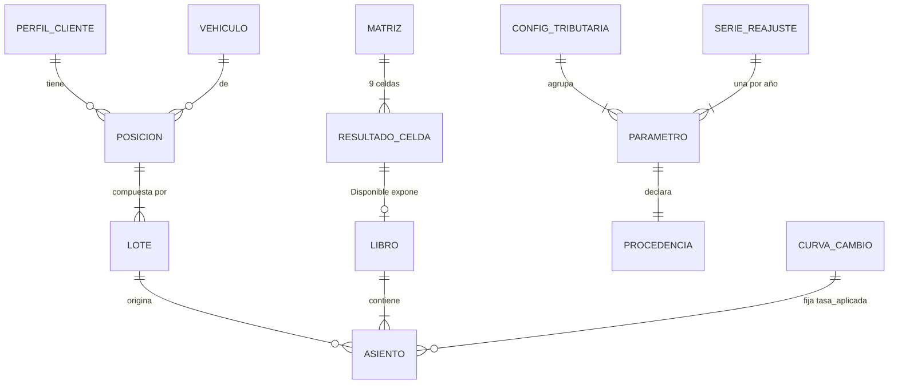

# Data Model — Motor de Fricción Neta

**Fase 1 de `/speckit-plan`** · 2026-08-24

Todos los tipos viven en `motor/dominio/`, son `frozen=True` y no hacen E/S (`AD-1`, `AD-21`). Este documento define **forma e invariantes**, no implementación.

> Doce de los quince pares de divergencia que encontró el Reviewer Gate nacían de tener estos tipos *declarados* pero no *especificados*. Este documento existe para cerrar esa brecha.

---

## 1. Tipos de valor

### `Moneda`

`StrEnum` cerrado: `COP`, `USD`. Ampliable por configuración del catálogo, nunca inferido.

### `Money` — `AD-4`

| Campo | Tipo | Nota |
|---|---|---|
| `monto` | `Decimal` | Nunca `float` |
| `moneda` | `Moneda` | Explícita, siempre |

**Invariantes**
- Toda operación aritmética entre `Money` de monedas distintas levanta `MonedaIncompatible`.
- Convertir exige pasar por `CurvaDeCambio` (`AD-18`). No existe conversión implícita.
- La cuantización a centavos ocurre **solo al presentar**, con `ROUND_HALF_UP`. Dentro del núcleo circula la precisión completa.

### `Cantidad` — `AD-45`

Envuelve un `Decimal` de **escala fija 8**. Existe separada de `Money` porque una participación no es dinero y `AD-4` no la cubría.

**Invariantes**
- `float` está prohibido en su construcción y en toda aritmética.
- Todo redondeo declara el destino de su residuo (`AD-40`).
- Invariante de conservación: `sum(l.cantidad for l in posicion.lotes) == posicion.cantidad`. Su violación levanta `CantidadNoConservada`.

### `Procedencia` — `AD-35`, `AD-49`

| Campo | Tipo |
|---|---|
| `fuente` | `str` — referencia normativa o documental |
| `fecha_vigencia` | `date` |
| `estado` | `EstadoProcedencia` |

`EstadoProcedencia` es un `StrEnum` cerrado: `verificado_profesional`, `supuesto_no_verificado`.

**Invariantes**
- Su ausencia en un parámetro tributario levanta `ProcedenciaNoDeclarada`.
- La agregación es un **retículo peor-gana**: si cualquier insumo es `supuesto_no_verificado`, el resultado lo es.
- **Estado actual del proyecto:** todo parámetro derivado del material disponible nace `supuesto_no_verificado`.

---

## 2. Tiempo

### `Reconocimiento` — `AD-42`

| Campo | Tipo |
|---|---|
| `anio_fiscal` | `int` |
| `momento` | `Momento` — `apertura` \| `cierre` |

**El dominio no conoce fechas de calendario.** No existe `fecha_adquisicion`.

**Rationale:** un motor que avanza por años no puede leer un reloj día a día. Con fechas, un lote de reinversión de enero y otro de diciembre del mismo año cruzarían el umbral de tenencia en sentidos opuestos, saltando entre la tarifa de ganancia ocasional y la marginal de cédula general sobre la misma operación.

**Invariantes**
- La tenencia se mide en **años fiscales completos**, por una única función.
- La regla del borde —qué ocurre cuando la tenencia iguala exactamente el umbral— está declarada y tiene test propio.
- El orden entre reconocimientos es total: `(anio_fiscal, momento)`, con `apertura < cierre`.

---

## 3. Lotes y posición

### `Lote` — `AD-29`, `AD-38`, `AD-40`, `AD-42`

| Campo | Tipo | Nota |
|---|---|---|
| `lote_id` | `LoteId` | Determinístico desde `(corrida_id, vehiculo_id, secuencia)` |
| `cantidad` | `Cantidad` | |
| `costo_origen` | `Money` | Incluye comisiones de compra (`AD-34` paso 1) |
| `trm_reconocimiento` | `Decimal` | **Congelada** al reconocimiento inicial |
| `reconocimiento` | `Reconocimiento` | |
| `origen` | `OrigenLote` | `aporte_inicial` \| `reinversion_dividendo` \| `particion` |

**Invariantes**
- **`lote_id` es el único campo que participa en `__eq__` y `__hash__`.** Sin esto, `frozen=True` produce igualdad por valor: el contrafactual de `AD-28` iguala la TRM de todos los lotes, dos lotes distintos se vuelven idénticos, y una exclusión por pertenencia elimina dos donde se vendió uno.
- `trm_reconocimiento` **nunca se recomputa** (art. 269 ET). `CurvaDeCambio.tasa_valoracion` no se usa para recalcular la base de un lote existente.
- Toda reinversión de dividendo **crea un lote nuevo**; ninguna operación incrementa la cantidad de un lote existente.

### `Lote.partir(cantidad) -> (vendido, remanente)` — `AD-40`

**Única vía** de fraccionar un lote. Ambos hijos **heredan** `trm_reconocimiento` y `reconocimiento` del original; partir nunca reconoce nada nuevo. El residuo del redondeo va al remanente.

**Rationale:** siendo el lote inmutable, sin esta regla cada implementación inventaría qué representa el remanente. Un remanente que hereda el reloj frente a uno "reconocido" en el año de la venta produce impuestos radicalmente distintos sobre la misma operación, sin ninguna reinversión de por medio.

### `Posicion`

Secuencia inmutable de `Lote` de un mismo vehículo para un mismo perfil.

### `AsignacionDeVenta` — `AD-39`

Dueño único: `motor/fiscal/`. `motor/friccion/` consume el resultado y **no reordena**.

| Método | Orden |
|---|---|
| `fifo` (por defecto) | `(anio_fiscal, momento, secuencia)` — **orden total**, nunca solo por año |
| `identificacion_especifica` | Orden declarado explícitamente en la corrida |

**Invariante:** se calcula **una vez por corrida y se congela para las nueve celdas**. Ninguna celda la reoptimiza — hacerlo volvería las celdas incomparables entre sí.

---

## 4. El libro de asientos

### `Concepto` — `AD-20`, `AD-46`

`StrEnum` cerrado. Cada miembro declara cuatro atributos:

| Atributo | Valores |
|---|---|
| `modulo_dueno` | `friccion` \| `fiscal` \| `cumplimiento` |
| `signo` | `aporte` \| `detraccion` |
| `grupo_waterfall` | Capa del gráfico de cascada |
| `naturaleza` | `flujo` \| `saldo` |

**Invariante clave:** `motor/fiscal/` es el **único** dueño de todo concepto tributario, incluidas la retención en origen, el ajuste por reajuste y el sobrecosto por fragmentación. `motor/friccion/` los solicita; no los calcula ni los escribe.

**Rationale:** con `concepto` como texto libre, la retención en origen —asignada a la vez a `fiscal` por la tabla de capas y a `friccion` por el bucle anual del brief §5.3— se escribiría dos veces con nombres distintos y signos opuestos. Resultado: doble conteo, dos barras en el waterfall para una sola fricción, y si los signos se cancelan, **un total limpio y equivocado que ningún test unitario de módulo detecta**.

### `Asiento` — `AD-8`, `AD-17`, `AD-46`, `AD-49`

| Campo | Tipo |
|---|---|
| `anio_fiscal` | `int` |
| `concepto` | `Concepto` |
| `monto_origen` | `Money` |
| `monto_cop` | `Money` |
| `tasa_aplicada` | `Decimal` |
| `anio_tasa` | `int` |
| `naturaleza` | `Naturaleza` |
| `formula` | `str` — legible, audita el cálculo |
| `inputs` | `Mapping[str, str]` |
| `parametros` | `frozenset[ParametroId]` |
| `lote_id` | `LoteId \| None` |

**Es bimonetario y se convierte al escribir** (`AD-17`). Sin esto, `motor/friccion/` escribiría en USD y `motor/fiscal/` en COP, ambos cumpliendo todas las reglas — y derivar el retorno neto en COP sumando el libro levantaría `MonedaIncompatible`. **El entregable central del brief §5.7 sería imposible por construcción.**

**Invariantes**
- `append` rechaza un concepto que no pertenezca al módulo que escribe (`ConceptoAjeno`).
- `append` rechaza un signo contrario al declarado por el concepto.
- `append` rechaza una `naturaleza` que no coincida con la del concepto (`NaturalezaAjena`).

### `LibroDeAsientos` — `AD-8`, `AD-41`

**Clave de cinco campos:**

```
(corrida_id, vehiculo_id, escenario, modo_reajuste, mundo)
```

`mundo` ∈ `{real, contrafactual}`. Son **18 libros por vehículo** (3 escenarios × 3 modos × 2 mundos).

**Rationale:** con la clave de tres campos, los tres modos de reajuste pasaban el guard y escribían en el mismo libro; `AD-8` obliga a derivar los totales sumándolo, así que **el costo fiscal salía sumando los tres ajustes**. `ReajusteDoble` no lo atrapaba, porque vigila el cálculo y no la suma. Segundo flanco: el contrafactual de `AD-28` escribe sus propios asientos porque `AD-34` se lo exige, y el impuesto quedaba duplicado.

**Invariantes**
- Append-only. Rechaza todo asiento cuya clave no coincida (`ClaveDeLibroAjena`).
- **Solo los flujos agregan** (`AD-46`). Toda derivación de totales filtra `naturaleza == flujo`; los saldos se consultan por año y nunca se suman entre sí.
- Ningún total se calcula por una vía paralela al libro.

---

## 5. Configuración normativa

### `ParametroTributario` — `AD-7`, `AD-35`

| Campo | Tipo |
|---|---|
| `id` | `ParametroId` |
| `valor` | `Decimal \| None` — `None` cuando el YAML trae el centinela `TODO` |
| `procedencia` | `Procedencia` |

**Invariante:** un `valor` en `None` consumido por un cálculo levanta `ParametroTributarioFaltante`. **Nunca hay valor por defecto numérico.**

### `SerieReajuste` — `AD-31`, `AD-43`

| Campo | Nota |
|---|---|
| `modo` | `art_70` \| `art_73` |
| `ventana` | `anual` \| `acumulada` — **declarada, jamás inferida** |
| `campo_indice` | Qué campo del lote indexa la serie |
| `entradas` | Una por año, sin huecos |

**Invariante:** un año ausente levanta `VigenciaNoCubierta`. **Nunca se interpola, extrapola ni hereda del año vecino.**

> `ventana` y `campo_indice` son **decisiones normativas escaladas al tributarista**, no lecturas de este diseño. Mientras no estén declaradas, la corrida falla.

### `ModoReajuste` — `AD-31`

`StrEnum` cerrado: `sin_reajuste`, `art_70`, `art_73`. **Excluyentes.** Cualquier ruta que intente componer dos ajustes levanta `ReajusteDoble`, con el mismo rigor que `MonedaIncompatible`.

---

## 6. Catálogo y perfil

### `Vehiculo` — `AD-5`, `AD-6`, `AD-32`, `AD-50`

| Campo | Tipo | ¿Porta procedencia? |
|---|---|---|
| `isin`, `ticker`, `nombre_legal_completo` | `str` | No |
| `domicilio` | `Domicilio` | No |
| `ter`, `dividend_yield_historico` | `Decimal` | No — dato de mercado |
| `moneda`, `mercado`, `brokers` | — | No |
| `fuente_documental` | `str` | — |
| **`forma_juridica_emisor`** | `FormaJuridica` | **Sí** |
| **`evento_ingreso_anual`** | `EventoIngreso` | **Sí** |
| **`retorno_esperado_base`** | `bruto_de_ter` \| `neto_de_ter` | No |
| **`elegibilidad_art_73`** | `Elegibilidad` | **Sí** |

**`AD-50`:** los tres campos marcados son **juicios normativos**, no datos de mercado, y portan `Procedencia` completa con `estado`. Sin esto, `elegibilidad_art_73` —el juicio del que depende una diferencia de un cuarto del costo fiscal— viviría junto al TER con solo una `fuente_documental` sin estado, evadiendo `AD-35` y presentándose al cliente como hecho establecido.

**Invariantes**
- Todos obligatorios, sin valor por defecto.
- `elegibilidad_art_73 == sin_clasificar` ⇒ el modo `art_73` levanta `ElegibilidadNoClasificada`. **Nunca degrada en silencio a `art_70`.**
- El impuesto anual despacha sobre `evento_ingreso_anual`, **nunca** sobre el tipo de distribución (`AD-5`).
- El TER se resta **solo si** `retorno_esperado_base == bruto_de_ter` (`AD-6`).

### `PerfilCliente` — `AD-33`

| Campo | Tipo |
|---|---|
| `tarifa_marginal_cedula_general` | `Decimal` |
| `activo_fijo` | `bool` |

**Invariante:** `activo_fijo == False` ⇒ `art_70` y `art_73` se emiten como `NoDisponible`, y solo `sin_reajuste` produce cifras. **El motor nunca infiere este flag.** Es propiedad de quién tiene el activo, no de qué activo es — por eso vive en el perfil y no en el catálogo.

### `DestinoDividendo` — `AD-51`

`StrEnum` cerrado: `reinvertir` (por defecto), `acumular_caja`, `repatriar`.

**Invariante — el spread cambiario depende del modo:**

| Modo | Spread | Por qué |
|---|---|---|
| `reinvertir` | En cada reinversión | Lote nuevo implica conversión nueva |
| `acumular_caja` | **No se aplica hasta la salida** | El efectivo permanece en moneda de origen |
| `repatriar` | **Cada año** | El efectivo vuelve a COP anualmente |

Usa `CurvaDeCambio.tasa_transaccion`, **nunca** `tasa_valoracion`. El resultado declara siempre qué modo se usó.

---

## 7. Tipo de cambio

### `CurvaDeCambio` — `AD-18`, `AD-30`

**Único origen de tasas del sistema.** Dos métodos **no intercambiables**:

| Método | Qué devuelve | Para qué |
|---|---|---|
| `tasa_valoracion(anio)` | TRM del año, **sin** spread | Valorar posiciones, causar impuesto |
| `tasa_transaccion(anio, sentido)` | TRM **más** el spread del bróker | Convertir efectivo que efectivamente se mueve |

**Invariantes**
- Ningún módulo construye una tasa aritméticamente.
- Ningún módulo aplica spread por su cuenta.
- **No recomputa la base de costo de un lote existente** (`AD-30`).
- El asiento registra cuál se usó en `tasa_aplicada` y `anio_tasa`.

**Rationale:** sin dueño único, `motor/friccion/` podría valorar un dividendo a tasa de cierre y `motor/fiscal/` gravarlo a tasa de apertura, con lo cual la razón impuesto/dividendo dejaría de coincidir con ninguna tarifa de la configuración. Y nadie decía si el spread FX entra en la valoración: son 30 a 100 puntos básicos, **la magnitud que el brief §1 declara ser el producto**.

---

## 8. Resultados

### `ResultadoCelda` — `AD-48`

**Suma cerrada:**

```
ResultadoCelda = Disponible(libro, totales, alertas) | NoDisponible(razon)
```

`RazonNoDisponible` es un `StrEnum` cerrado: `PERFIL_NO_ACTIVO_FIJO`, `ELEGIBILIDAD_SIN_CLASIFICAR`, `MODO_NO_APLICA`, `VIGENCIA_NO_CUBIERTA`.

**Invariantes**
- Ningún consumidor coacciona `NoDisponible` a un número.
- El ordenamiento de `AD-26` opera **solo** sobre celdas `Disponible`, y el resultado declara cuántas quedaron fuera y por qué.
- Las nueve celdas **siempre existen**; ninguna se omite.

**Rationale:** sin este tipo, `AD-33` devolvía tres celdas donde `AD-24` exige nueve, el `Renderer` rechazaba el payload, y **ningún perfil que no fuera activo fijo obtenía memorando**. Y coaccionar la celda ausente a cero la haría participar en el ordenamiento como si fuera el mejor resultado.

### `MatrizDeResultados`

`Mapping[(Escenario, ModoReajuste), ResultadoCelda]` — nueve entradas, siempre.

### Métricas derivadas

| Métrica | AD | Nota |
|---|---|---|
| Retorno bruto y neto acumulado en COP | `AD-8` | Derivado sumando flujos del libro |
| Desglose de fricción (COP y pb anualizados) | `AD-8`, `AD-20` | Agrupado por `grupo_waterfall` |
| TIR neta anualizada | `AD-8` | |
| Porción del impuesto por devaluación | `AD-28` | **Contrafactual**, lote por lote, dentro de un modo fijo |
| Sobrecosto por fragmentación | `AD-37` | `Money`, como asiento |
| Ratio de fragmentación | `AD-47` | Denominador = **base gravable total**; `NoDisponible` si es ≤ 0 |
| Valor patrimonial anual | `AD-36`, `AD-46` | `naturaleza: saldo` — **nunca agrega** |

---

## 9. Excepciones del dominio

Todas tipadas, todas en `motor/dominio/`. El núcleo **nunca registra logs ni imprime**: devuelve o levanta.

| Excepción | Se levanta cuando |
|---|---|
| `MonedaIncompatible` | Aritmética entre monedas distintas |
| `CantidadNoConservada` | La suma de lotes ≠ cantidad de la posición |
| `ParametroTributarioFaltante` | Parámetro ausente o con centinela `TODO` |
| `VigenciaNoCubierta` | Año simulado sin configuración vigente |
| `ProcedenciaNoDeclarada` | Parámetro tributario sin `Procedencia` |
| `ReajusteDoble` | Composición de art. 70 con art. 73 |
| `ElegibilidadNoClasificada` | `art_73` sobre vehículo `sin_clasificar` |
| `ConceptoAjeno` | Módulo escribe un concepto que no le pertenece |
| `NaturalezaAjena` | Asiento cuya naturaleza no coincide con la del concepto |
| `ClaveDeLibroAjena` | Asiento cuya clave no coincide con la del libro |
| `ConvencionTerNoDeclarada` | Vehículo sin `retorno_esperado_base` |

---

## 10. Diagrama de relaciones



Un `LIBRO` por combinación `(corrida, vehículo, escenario, modo, mundo)`: **18 por vehículo**.
